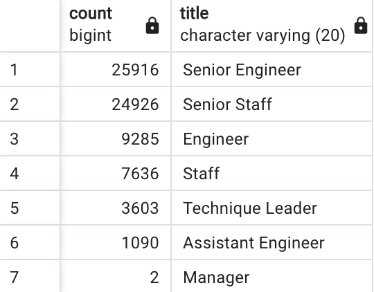

# Pewlett_Hackard_Analysis

___
It is not easy to stand at the origins of a huge corporation, but it is very important to always keep the situation under control!
Timely consideration of the task will always lead to success. Here is a good example - we received a request from a reputable corporation to check the staff for the age limit and see if there will be a shortage of qualified personnel in the near future. To solve this problem, we have taken the following steps:
___
## **STEP1**
***At the beginning, we collected the received data and sorted it to highlight the ones that were necessary for us.***

### ***By using next query №1***
___
```SQL
SELECT e.emp_no,
    e.first_name,
    e.last_name,
    t.title,
    t.from_date,
    t.to_date
-- INTO retirement_title
FROM employees as e
INNER JOIN titles as t
ON e.emp_no = t.emp_no
WHERE (e.birth_date BETWEEN '1952-01-01' AND '1955-12-31')
ORDER BY e.emp_no;
```
1. ***sorting data***


### ***By using next query №2***
___
```SQL
-- Use Dictinct with Orderby to remove duplicate rows
SELECT DISTINCT ON (emp_no) emp_no,
first_name,
last_name,
title
-- INTO unique_titles
FROM retirement_title 
WHERE to_date = ('9999-01-01')
ORDER BY emp_no, to_date DESC;
```
2. ***get the unique title***


### ***By using next query №3***
____
```SQL
-- Create a new table with number of employees by their job titile who are about to retire 
SELECT COUNT (emp_no), title
-- INTO retiring_titles
FROM unique_titles 
GROUP BY title 
ORDER BY count DESC;
```
3. ***get the retiring title***
   


### ***By using next query №4***
___
```SQL
-- Create a table for mentorship eligibility
SELECT DISTINCT ON (e.emp_no) e.emp_no,
                e.first_name,
                e.last_name,
                e.birth_date,
				de.from_date,
				de.to_date,
				t.title
INTO mentorship_prog
FROM employees as e
    INNER JOIN dept_emp as de
	     ON (e.emp_no = de.emp_no)
	INNER JOIN titles as t
	     ON (e.emp_no = t.emp_no)
WHERE (de.to_date = '9999-01-01')
     AND(e.birth_date BETWEEN '1965-01-01' AND '1965-12-31');	
```

4. ***get the mentorship eligibility title***

____

## **I hope we did our best!!!**